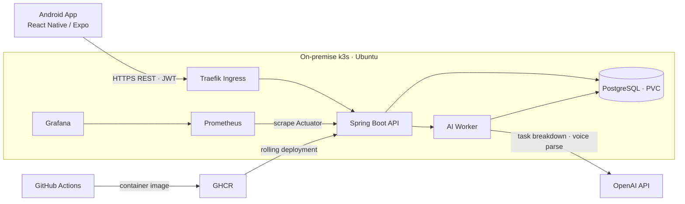

# AntiADHD 시스템 아키텍처

AntiADHD는 공개 포트폴리오와 실제 애플리케이션 실행 환경을 분리한다. 포트폴리오는 공개 정적 사이트이고, 사용자 데이터와 API는 홈 네트워크의 단일 노드 k3s 클러스터 안에서 운영한다.

## 계층별 책임

| 계층 | 구성 | 책임 |
|---|---|---|
| Client | React Native, Expo, TypeScript | 일정·집중 UI, 음성 녹음, 토큰 보관, 입력 확인 |
| Edge | Traefik Ingress | 단일 진입점, 경로 라우팅, 외부 노출 범위 통제 |
| Application | Spring Boot, Spring Security, JPA | 인증·인가, 도메인 규칙, REST API, 헬스·메트릭 |
| Async AI | 별도 Worker Deployment | 오래 걸리는 AI 요청을 API 처리 경로에서 분리 |
| Data | PostgreSQL, Flyway, PVC | 영속 데이터, 스키마 버전 관리, 백업·복구 |
| Observability | Prometheus, Grafana | 상태·지연·오류 관측과 운영 대시보드 |
| Delivery | GitHub Actions, GHCR, Kustomize | 테스트, 보안 검사, 이미지 배포, 환경별 설정 |

## 설계 결정

### k3s를 선택한 이유

k3s는 Kubernetes API와 핵심 객체를 유지하면서 단일 홈 서버에서 요구 자원을 줄일 수 있다. AntiADHD의 현재 사용자는 2명이므로 고가용성 클러스터보다 Deployment, Service, Ingress, Secret, PVC, 관측과 복구를 실제로 운영하는 경험을 우선했다.

### AI Worker를 분리한 이유

AI 응답은 일반 CRUD보다 지연과 실패 가능성이 크다. 별도 Deployment로 분리하면 API Pod의 응답성과 장애 격리를 개선하고, 향후 큐 기반 비동기 처리와 독립 스케일링으로 확장할 수 있다.

### 공개 범위

공개 포트폴리오에는 제품·아키텍처·검증 결과만 제공한다. 실제 API, PostgreSQL, Grafana와 Kubernetes 관리 인터페이스는 홈 네트워크 경계 안에 두며 Secret 원문은 Git에 저장하지 않는다.

## 배포 흐름

1. Pull request에서 Backend test, Mobile test/E2E, dependency/security scan을 수행한다.
2. 승인된 `main` 커밋으로 Backend 이미지를 빌드해 GHCR에 커밋 SHA 태그로 저장한다.
3. Kustomize overlay가 이미지 버전과 환경 설정을 구성한다.
4. k3s Deployment가 rolling update를 수행하고 readiness가 통과한 Pod만 Service에 연결한다.
5. 실패 시 직전 SHA 이미지로 롤백하고 로그·Actuator·Grafana로 원인을 확인한다.

## 현재 한계와 확장 경로

- 단일 노드이므로 서버 장애 시 서비스가 중단된다. 현재 규모에는 비용 대비 합리적이지만 고가용성은 아니다.
- PostgreSQL은 로컬 영속 볼륨을 사용한다. 정기 백업과 복구 훈련이 필수이며, 다음 단계는 외부 백업 저장소다.
- AI Worker는 분리되어 있지만 영속 메시지 큐는 아직 없다. 요청량이 증가하면 Redis/RabbitMQ 기반 재시도·멱등 처리를 도입한다.
- 공개 서비스로 전환할 때는 도메인, TLS 자동화, WAF/Rate limit, 외부 가용성 모니터링을 추가한다.
