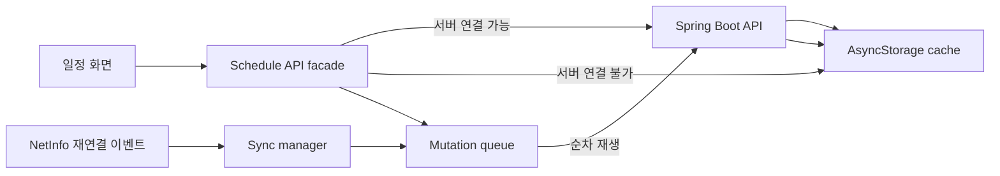

# 오프라인 일정 저장과 재연결 동기화

## 목적

AntiADHD의 서버는 개인 온프레미스 k3s 환경에서 실행된다. 홈 서버가 꺼져 있거나 외부 네트워크에서 접근할 수 없더라도 사용자가 일정 조회·등록·수정·완료·삭제를 계속할 수 있도록 모바일 앱을 오프라인 우선 구조로 변경했다.

## 데이터 흐름

## 저장 범위

- 서버에서 읽은 일정은 사용자 이메일로 분리된 AsyncStorage 공간에 저장한다.
- 오프라인 생성 일정은 충돌하지 않는 음수 임시 ID를 사용한다.
- 등록, 수정, 완료 변경, 삭제를 순서가 보존되는 mutation queue에 저장한다.
- 계정이 바뀌어도 다른 사용자의 캐시가 노출되지 않는다.

## 동기화

다음 시점에 자동 동기화를 시도한다.

1. 로그인 세션 복원 직후
2. 네트워크가 다시 연결됐을 때
3. 앱이 백그라운드에서 활성 상태로 돌아올 때
4. 사용자가 동기화 배너에서 `다시 시도`를 눌렀을 때

동기화는 큐의 앞에서부터 순차 실행한다. 오프라인 생성이 서버 생성으로 전환되면 음수 임시 ID를 서버 ID로 교체하고, 뒤에 대기 중인 완료·삭제 작업도 새 ID로 다시 연결한다.

## 충돌 정책

현재 규모에서는 `Last Write Wins`를 사용한다.

- 대기 작업을 보내기 전 서버의 `updatedAt`을 조회한다.
- 서버 수정 시각이 로컬 작업 시각보다 늦으면 서버 변경을 유지하고 로컬 작업을 폐기한다.
- 로컬 작업 시각이 같거나 더 늦으면 로컬 작업을 서버에 반영한다.
- 서버에서 이미 삭제된 일정을 다시 삭제하는 작업은 성공으로 처리한다.

이 정책은 단순하고 2인 비공개 베타에 적합하지만 기기 시계가 크게 어긋나면 정확도가 낮아질 수 있다. 다중 사용자 협업 기능으로 확장할 때는 서버 발급 revision 또는 ETag 기반 optimistic concurrency control로 교체한다.

## 장애 대응

- 첫 네트워크 실패 후 30초간 서버 호출을 우회하는 간단한 circuit breaker를 사용한다.
- 로컬 LAN API의 응답 제한은 4초로 설정해 홈 서버가 꺼졌을 때 화면이 오래 멈추지 않게 한다.
- 동기화 실패는 일정을 삭제하지 않고 큐에 유지한다.
- 화면에는 대기 작업 수, 동기화 상태와 재시도 버튼을 표시한다.

## 현재 한계

- 오프라인 기능은 일정 도메인에 먼저 적용했다. AI, 루틴 자동 생성과 로그인은 서버 연결이 필요하다.
- 앱을 삭제하거나 OS 앱 데이터를 지우면 동기화 전 로컬 변경이 사라진다.
- AsyncStorage는 암호화 저장소가 아니므로 일정에 민감한 개인정보를 기록하지 않는 것을 전제로 한다.
